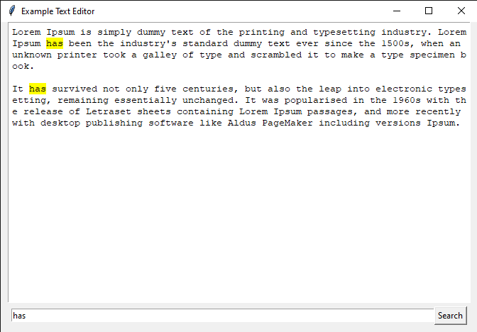

# Python Simple Text Editor



Simple python text editor project using tkinter
## Run
```sh
git clone https://github.com/fitri-hy/python-simple-text-editor.git
```
```sh
cd python-simple-text-editor
```
```sh
pip install tk
```
```sh
python main.py
```

Follow Me: <a href="https://hy-tech.my.id/">Follow</a>
